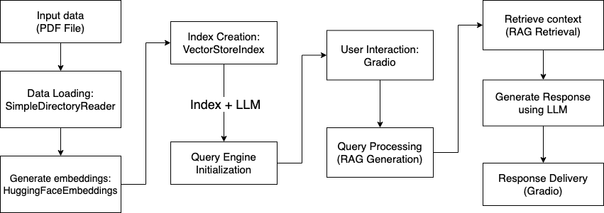
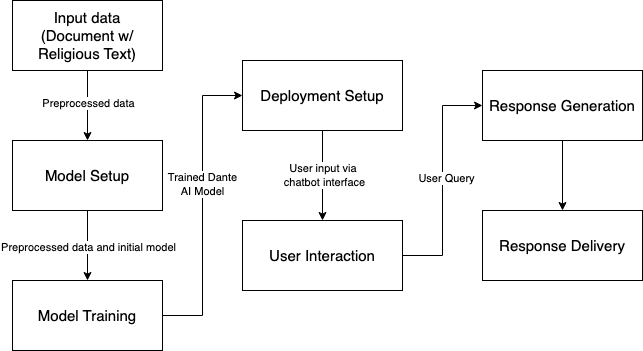

# Capstone-Religious-Text-Chatbot
This is a repository designed to fine tune an AI model on St. Ignatius' teachings.

## Introduction
This project seeks to customize an AI model for educational use, centering on St. Ignatius's teachings. The model will function locally and provide accurate responses tailored to educational settings.

## Objectives
The goals and objectives for the project include:
- Create a fully operational AI model
- Train the model on St. Ignatius' teachings
- Model will assist students and teachers in creating educational materials
- Model will provide personalized learning

## Further Studies
#### Large Language Models: A Survey.
Authors: Shervin Minaee, Tomas Mikolov, Narjes Nikzad, Meysam Chenaghlu
Richard Socher, Xavier Amatriain, Jianfeng Gao
Key points:
- Introduction: Highlights rising interest in LLMs after ChatGPT, focusing on their natural language capabilities.
- Prominent Models: Overview of GPT, LLaMA, and PaLM.
- Techniques: Insights into datasets used for training.
- Evaluation Metrics: Reviews methods for assessing LLM performance.
- Benchmark Comparisons: Performance comparisons across leading LLMs.
- Challenges & Future Research: Explores current limitations and future directions for the field.

Minaee, S., Mikolov, T., Nikzad, N., Chenaghlu, M., Socher, R., Amatriain, X., & Gao, J. (2024). Large Language Models: A Survey. Retrieved from https://arxiv.org/pdf/2402.06196

### Uncovering Theological and Ethical Biases in LLMs: An Integrated Hermeneutical Approach Employing Texts from the Hebrew Bible.
Author: A.G. Elrod (Vrije University, Amsterdam)
Key Topics:
- Dataset: Texts from Exodus 20 and the Book of Jonah (Hebrew Bible).
- Research Focus: Examines biases in LLMs related to ethical and theological themes.
Methodology:
- Qualitative hermeneutical analysis (text interpretation).
- Quantitative textual analysis using GPT-4 Turbo, Claude v2, PaLM 2 Chat, Llama 2 70B, and Zephyr7B.
Findings:
- LLMs exhibit progressive bias, aligning with modern socio-political and environmental issues.
- Models reflect dominant historical interpretations of the Book of Jonah, lacking diversity in perspective.
- Implications: Highlights the need for multidisciplinary research on LLM biases, emphasizing their impact on religious and ethical narratives and broader societal issues.

Elrod, A. G. (2024). Uncovering Theological and Ethical Biases in LLMs: An Integrated Hermeneutical Approach Employing Texts from the Hebrew Bible. HIPHIL Novum, 9(1). Retrieved from https://tidsskrift.dk/hiphilnovum/article/view/143407/187035

## Proposed System

### Llama 3.2

Developer: Meta Platforms
Key Features:
- Open-source, multilingual text generation.
- Lightweight 3B version suitable for local execution.
Benefits:
- Ensures privacy.
- Provides instantaneous responses.
- Flexible with multilingual data.
Application: Personalized responses on Jesuit values and St. Ignatius’ teachings.

### Dante AI

Features:
- Human-like text generation and understanding.
- Fine-tunable for specific tasks and industries.
- Multilingual capabilities for global use.
- Maintains context in extended conversations.
- API-ready for seamless integration.
- Scalable for high traffic and complex queries.
- Built with strong data privacy and security.
- Adapts to new data for continuous improvement.

## Dataset
Title: “What Magis Really Means and Why It Matters”
Author: Fr. Geger
Overview: discusses the numerous definitions of Magis within Jesuit circles
Sections:
- States the issue of having multiple definitions for Magis
- Explores the different definitions
- Exemplifies how Magis is lived out
- How to apply Magis in today’s world
- What Magis doesn’t mean
- Addresses questions related to Magis

## Results
| Aspects   | Dante AI   | LLaMA 3.2 + Gradio  |
|------------|------------|------------|
| Ease of Use| Simple, ready-to-use setup| Requires technical setup and coding expertise|
| Response Time| Fast for document-specific queries (seconds)| Slower for document queries (~6 minutes)|
| Customization| Limited to platform capabilities| Fully customizable for specific needs|
| General Knowledge| Only answers queries based on provided data| Can answer general questions using model knowledge|
| Data Privacy| Data may be processed externally| Full control and privacy with local deployment|
| Cost| Subscription or pay-as-you-go fees| One-time setup cost; no ongoing fees|
| Resource Requirements| Minimal (cloud-hosted infrastructure)| Requires local hardware and computational power|

## Conclusion
Both chatbots have value
### Dante AI: 
- Best for quick deployment, fast responses, and ease of use, but limited in customization and data privacy
- Significant Pro: fast responses, suggests user inputs
- Significant Con: have to go into the backend to change the data the model is trained on
### Llama 3.2 + Gradio: 
- Ideal for tailored solutions, broader query capabilities, and privacy, but requires more time, expertise, and resources.
- Significant Pro: easy to change the data the model is trained on -> upload different document before running, local
- Significant Con: slow responses
